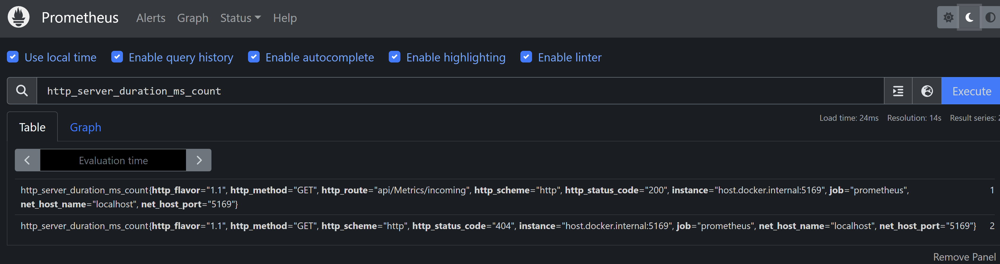

# Assigment 2

In Assigment 2 we are going to add a Prometheus Exporter and configure a prometheus scraper to scrape the Metrics and show this in a Docker Container which is running Prometheus. Note that it is not necessary to have docker installed then we will just skip the part for scraping the metrics but we will try to expose the metrics in the browser.

## Step 1
Start by adding the following NuGet package

- OpenTelemetry.Exporter.Prometheus.AspNetCore --prerelease

Change the code to include the prometheus exporter

```cs
builder.Services.AddOpenTelemetry()
    .WithMetrics(builder => builder
        .AddConsoleExporter()
        .AddAspNetCoreInstrumentation()
        .AddHttpClientInstrumentation()
        .AddRuntimeInstrumentation()
        .AddPrometheusExporter());

app.UseOpenTelemetryPrometheusScrapingEndpoint();
```

The following is an alternative if you want the metrics to be exposed on a different port then the api and different path. Also keep in mind that if you add a port you also have to arrange that in you're start-up url(s)
```cs
app.UseOpenTelemetryPrometheusScrapingEndpoint(
                context => context.Request.Path == "/metrics"
                    && context.Connection.LocalPort == 9090);
```

When running the application the following URL should give a metric result after the first hit to the application:
- http://localhost:5169/metrics

## Step 2

Second step is to configure prometheus with a scrape config. This scrape config will tell prometheus where to get its information from. (https://prometheus.io/docs/prometheus/latest/getting_started/#configure-prometheus-to-monitor-the-sample-targets)

In the following path of this repo a local config is defined for scraping the prometheus endpoint
- Metrics.NET\config\prometheus-config.yaml

```yaml
global:
  scrape_interval: 10s
  evaluation_interval: 10s

scrape_configs:
  - job_name: "prometheus"

    static_configs:
      - targets: ["host.docker.internal:5169"]
```

start a prometheus instance with the following docker command

```ps
docker run -it -p 9090:9090 -v {PATH}/prometheus-config.yaml:/etc/prometheus/prometheus.yml --name prometheus prom/prometheus
```

After opening the following url you should be able to get some information back in the prometheus container. You can open prometheus by using the following URL in the browser: http://localhost:9090/

