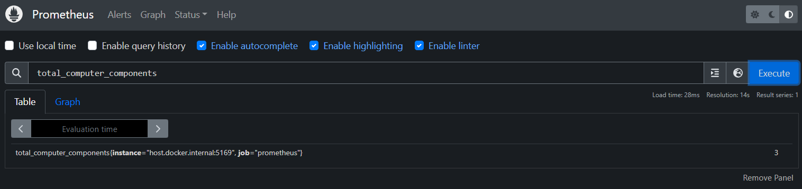
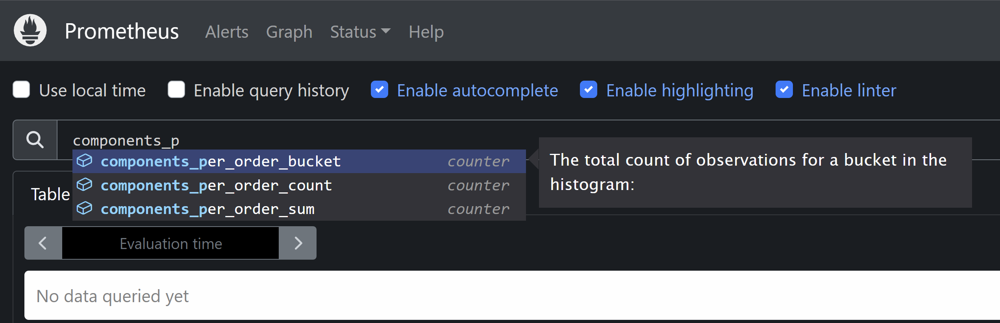
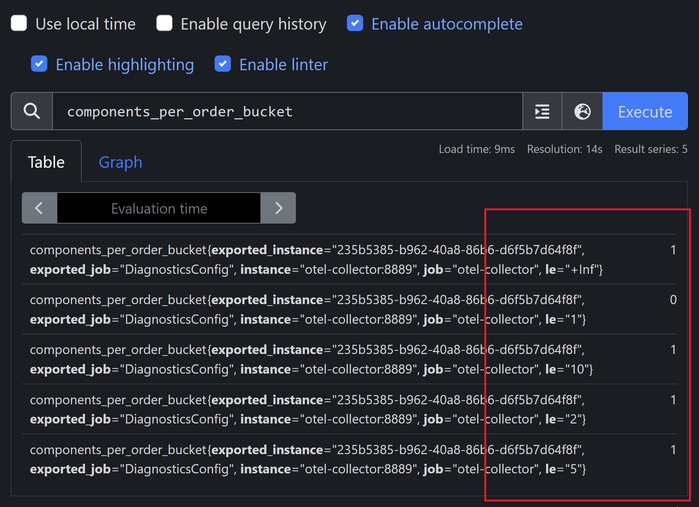

# Assigment 3

In Assigment 3 we are going to add a our own custom metrics. In the application we use an OrdersController which has a couple of static Lists to enlist orders for computer components. This ofcourse could have been anything else but this will do as for a demo project. 

## Step 1

The first step is to open the class `ComputerComponentsMetrics` This class has already the following Metrics defined

```cs
    private Counter<int> TotalOrdersCounter { get; }
    private Histogram<double> OrdersPriceHistogram { get; }
    private ObservableGauge<int> TotalComputerComponents { get; }
```

- Countter
  - Shows the total orders placed since starting the application
- Histogram
  - Shows the prices of the orders that are being checkout
- Gauge
  - Shows the amount of components per order being placed

\

  In this class the constructor is still empty fill in the correct items to ensure the metrics are properly setup.
  Also make sure that you use naming which is logical

  ```cs
   _meter = new(DiagnosticsConfig.ComputerComponentsMeterName);
       
   TotalOrdersCounter = _meter.CreateCounter<T>()
  ```

## Step 2

Implement the service `IComputerComponentsMetrics` in the OrdersController class. Make sure that on the correct api method you call the methods necessary for the metrics

## Step 3

Implement the Metrics service in you're startup class also don't forget to register the service as Singleton for DI

Extend the opentelemetry metrics with the following piece of code

```cs
.SetResourceBuilder(ResourceBuilder.CreateDefault().AddService(DiagnosticsConfig.ServiceName))
.AddMeter(DiagnosticsConfig.ComputerComponentsMeterName)
```

## Step 4

After doing all these steps you should be able to see the metrics in you're prometheus configuration running in Docker



## Step 5

Histograms are giving 3 values to look at 



- Count
  - This gives a total count of al the orders
- Sum
  - This gives a total count of all the components for the orders
- Bucket
  - This gives a total count of al the orders

The bucket is however a little different since it's working a bit differently. The bucket tells you how many items there are in the bucket. So for this particular example it means how many components are used per order.



Looking at the image you can see I placed 1 order with 2 components the reason is the bucket configuration
**le** means less or equal. For 1 it has 0 items and the other buckets have more then 1.

To make it visible or more logical you can create you're own bucket sizes. Use the following code to adjust you're bucket

```cs
.AddView(
    instrumentName: "components-per-order",
    new ExplicitBucketHistogramConfiguration { Boundaries = new double[] { 1, 2, 5, 10 } })
```