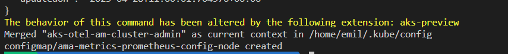
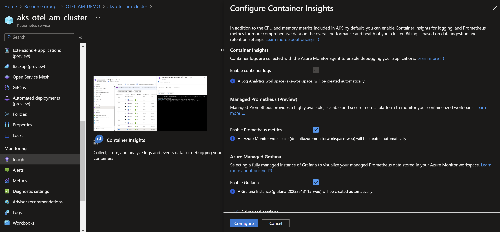
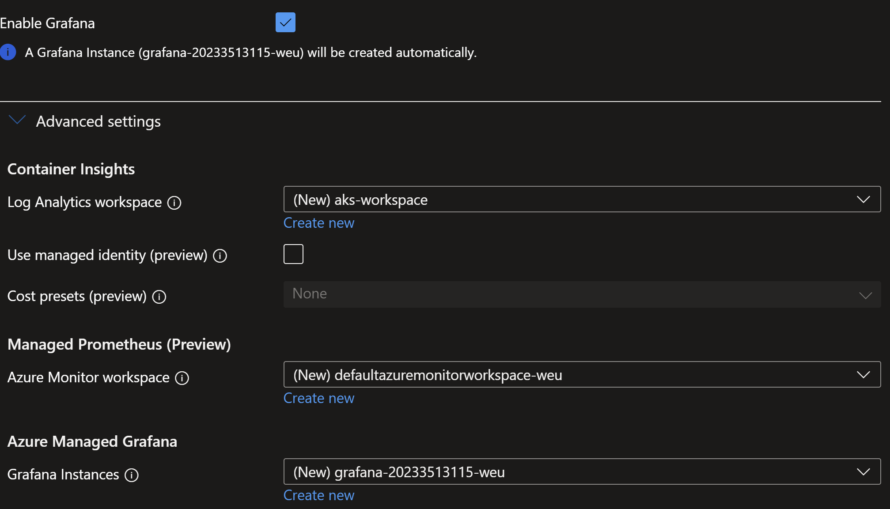
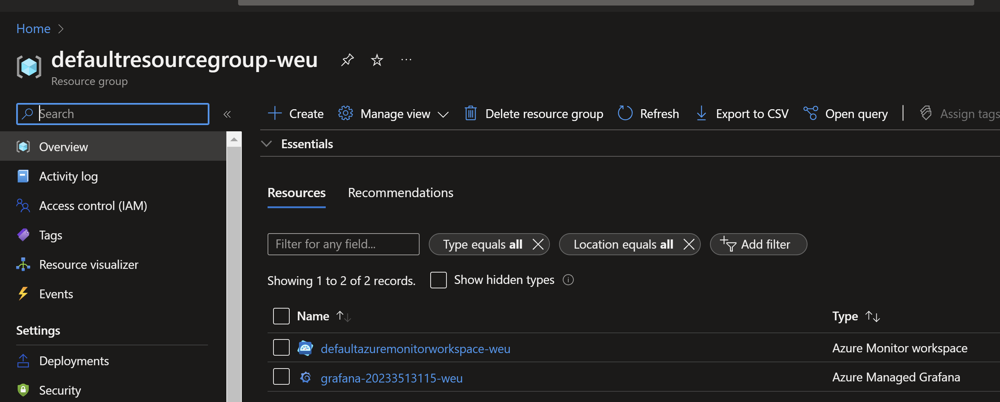
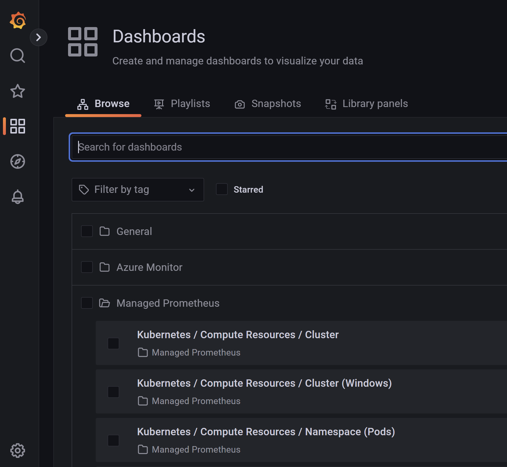

# Assignment 4

In Assigment 4 we start with setting up an AKS cluster to provide the necessary items to show the output of the application in a managed grafana dashboard. In the assigment following we will deploy the application to AKS

## Step 1
In the folder AKS everything is provided to generate an AKS cluster. Before you start make sure you have the Azure CLI installed and additionally the Kubectl command which is neccessary to create the prometheus config map.

Installation Prerequisites
- https://kubernetes.io/docs/tasks/tools/
- https://learn.microsoft.com/en-us/cli/azure/install-azure-cli

Open the file setup.sh in the folder AKS and change the parameters accordingly to something you would want to use
```sh
ResourceGroup="OTEL-AM-DEMO"
AksName="aks-otel-am-cluster"
AcrName=oteldamemo
AcrInstanceName="oteldamemo.azurecr.io"
```

After running ./setup.sh the following should be created
- ACR in the specified resource group
- AKS Cluster in the specified resource group
- Config map should be provisioned with a custom configuration for the prometheus scraper

The output of the script should end with something like this:


## Step 2
Enable Grafana and Prometheus on you're AKS cluster with bad practice clicking in the Portal. Just do this on demos and ofcourse not in general.
Got to the insights blade of you're AKS cluster and click on configure this allows you to select the following screen.


After opening the advanced settings you can make sure everything is new so no old other services will be affected by provisioning this
.

After everything is clicked correctly click on configure and wait for the provisioning to be completed this will take about 5 to 10 minutes. After the provisioning you can open the dashboards that show the stats of your running AKS cluster.

Note that grafana is privisioned in the resource-group `defaultresourcegroup-weu` don't know why:



Click on the grafana instance and open the endpoint-url



Open the different dashboards and have a look at them you should see the data of you're aks dashboard.