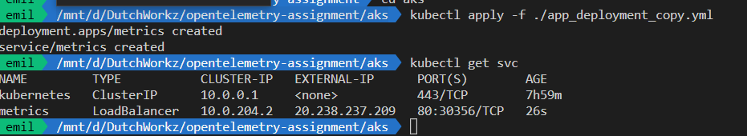

# Assignment 5

In Assigment 5 we will deploy our application to our just provisioned ACR and deploy it to AKS

## Step 1
The first step is to deploy our docker image to the Azure Container Registry. Since quite some time Azure ACR provides a way to also build the image and store it in the repository. So the easy way to build and store the image in acr use the following command

```sh
az acr build -t metrics:latest -r <replace_with_arc_name> -f ./Metrics.NET/Dockerfile .
```
When everything goes well the docker image should be deployed to the repository within your ACR.

## Step 2

In the following step you need to change the app_deployment.yml. This file is used to deploy the container to AKS and give it an external ip address. This help to expose it online. Ofcourse this is not something you would normally do this way then you would use an ingress controller but for the demo this will suffice.

The following items should be replaces
- <<replace_container_name>>
  - This should be replaced by the containername if you used the command in step 1 this should be metrics
- <<acr_name>>
  - This should be replaced by the name of ypur provisioned ACR

To enable the prometheus agent to scrape the metrics of this container additional annotations should be set in the app_deployment.yaml. The script on how to set the annotations was done in Assigment 4 step 1 on which the config map was provisioned to set the values for prometheus.

The Annotations below will tell the prometheus scraper where to look for the metrics.

```yaml
labels:
    app: <<replace_container_name>>
annotations:
    prometheus.io/scrape: 'true'
    prometheus.io/path: '/metrics'
    # default is 9090
    prometheus.io/port: '80'

```

## Step 3

After changing the deployment yaml it is time to provision it to AKS. 
```sh
kubectl apply -f ./app_deployment.yml
```

After deployment check if it succeeded with the following command

```sh
kubectl get svc
```

It should show the following


Open the url with the external IP-address the following should be accesable

- http://external-ip/swagger
- http://external-ip/metrics
