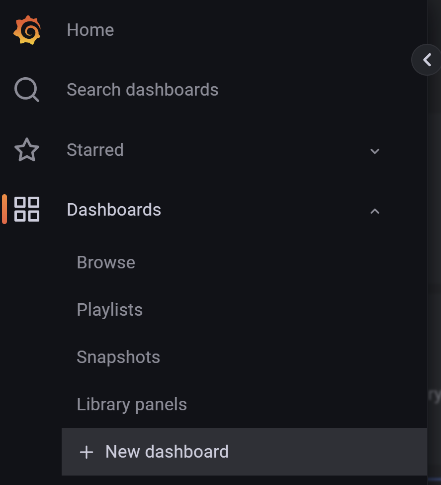
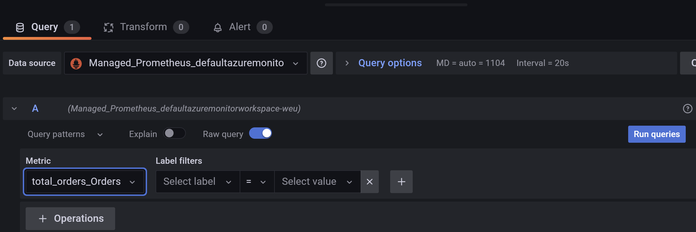
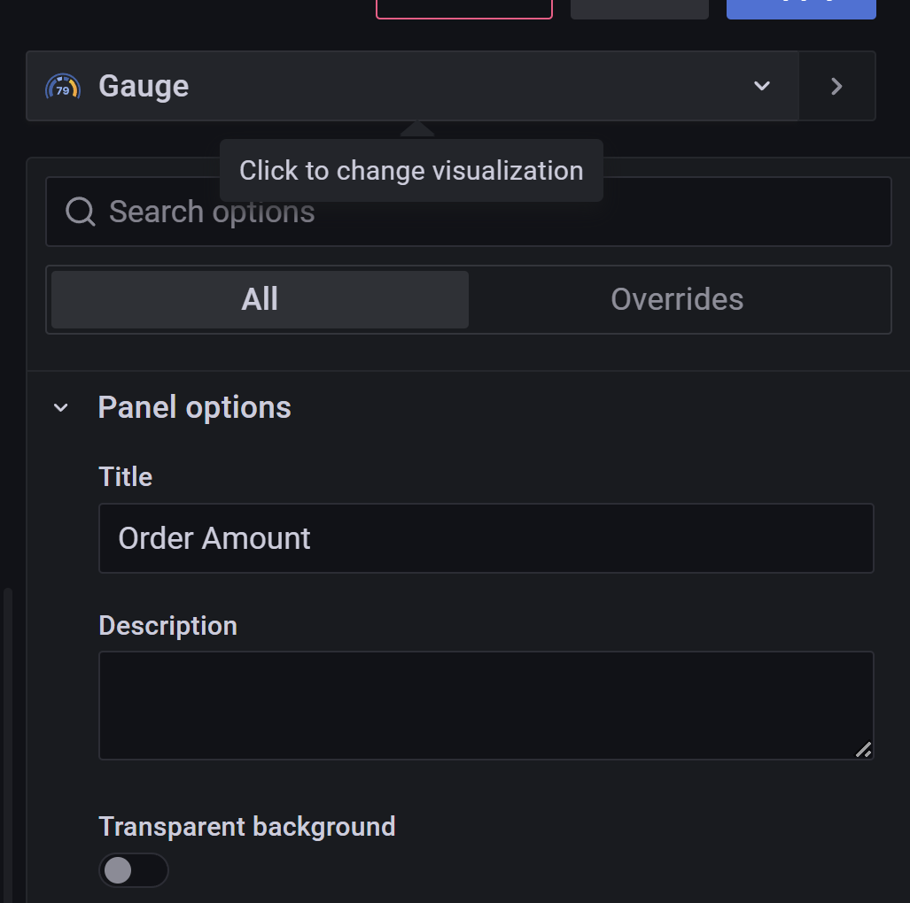
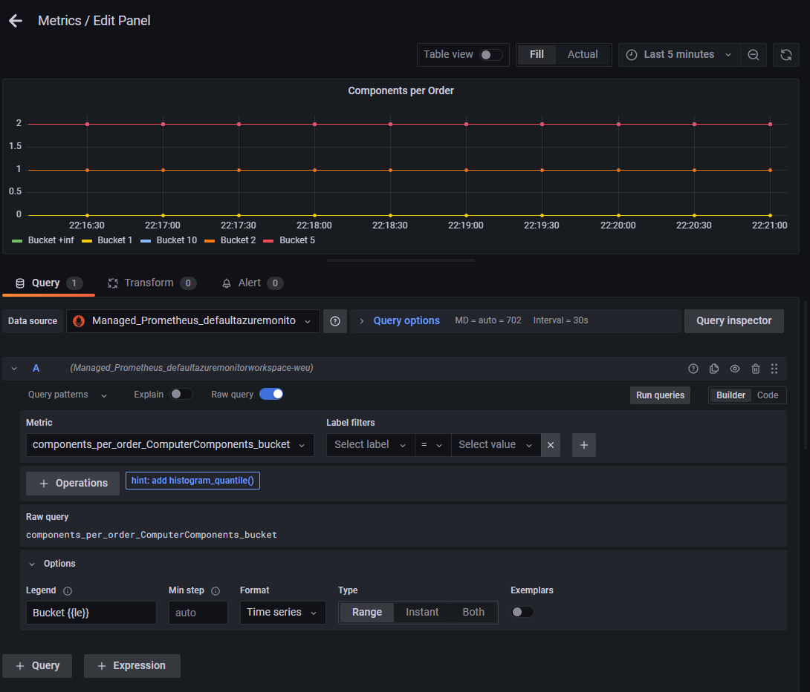
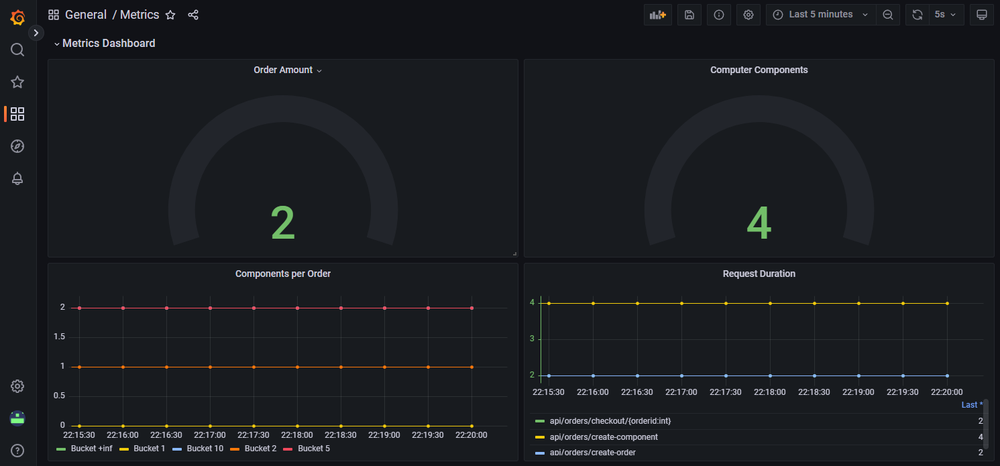

# Assignment 6

In the last step we will create the Grafana Dashboard and make all these metrics shine where we have worked so hard for.

## Step 1
Open the grafana URL and click on new dashboard and click on add a new panel

Select the right datasource and choose the correct metric

After that click on the visualization you want and adjust the title

Try to make one of the metrics and watch for the legend options which allows you to change the labels

Try to create a dashboard that looks like the following

## Step 2

You have now created metrics which are displayed in Managed Grafana in Azure which is getting metrics from an application you provisioned in AKS!!!!. 

To make it even nicer try to make new metrics and incorporate them in your're dashboard. Other steps you can do is provision the OTEL Collector in AKS and add an OTLP Exporter to it. These are all options you can do to make it even fancier.