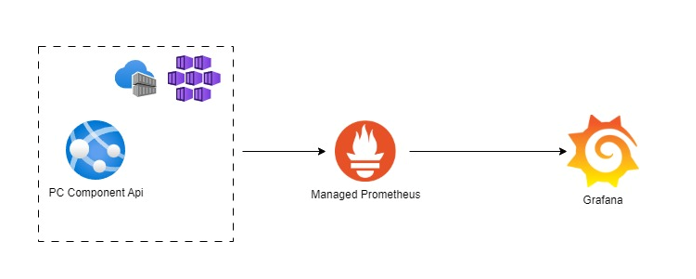

# opentelemetry-assignment

The Assignment is to create a simple Web API which consumes metrics by using the web api methods after this is created. All components in Azure need to be provisoned and configured to let the metrics be exposed to grafana.

- [Assignment 1](./Assignment/Assignment1.md)
- [Assignment 2](Assignment/Assignment2.md)
- [Assignment 3](Assignment/Assignment3.md)
- [Assignment 4](Assignment/Assignment4.md)
- [Assignment 5](Assignment/Assignment5.md)
- [Assignment 6](Assignment/Assignment6.md)